> SPLITTER LES INFORMATIONS DU CAHIER DES CHARGES DANS CE DOSSIER

# DOSSIER PROJET PERSONNEL

## Remerciements

## Sommaire

1. Résumé du projet en anglais [OK]

2. Liste des compétences du référentiel [OK]

3. Conception du projet
  - Première idée et évolutions du projet [OK]
  - Personas [OK]
  - User journeys [OK]
  - Charte graphique [OK]
  - Wireframe [OK]
  - Prototype [OK]

4. Gestion de projet
  - Tableau KANBAN [OK]
  - Rétroplanning [OK]

5. Spécifications fonctionnelles
  - Fonctionnement général de l'application [OK]
  - Plan de site
  - Modèle Conceptuel de Données [OK]

6. Spécifications techniques
  - Les technologies
  - L'architecture

7. Réalisation du projet
  - Développement
  - Améliorations et difficultés rencontrées dans le travail d'équipe
  - Etapes / Avancées principales du projet

## Résumé du projet en anglais (Introduction + Conclusion)

As part of the "Concepteur / Développeur d'Applications DevOps" course offered by the SIMPLON training organization, I took charge of all the design and production phases of my masterpiece project entitled "Les As de l'UX".

It's an application that mainly puts people in charge of creating or redesigning web projects (sites or applications) in touch with other users of the application (amateurs and UX design professionals alike) in order to automate user testing and thus gather several external and constructive opinions in the form of a global analysis, downloadable by the customer in the form of a PDF. All this allows the customer to retain control of their project by simply obtaining constructive advice from several users/testers of their web project.

At the end of the process, some users are rewarded for their feedback. This method of paid bug detection is based on the concepts of "Bug Bounty" (originally designed to detect bugs in code), continuous improvement and collective intelligence.

I chose the theme of UX Design because it's in line with one of my areas of interest, and it's a notion to which I've been made aware during my previous training courses.

To explain why I did this project on my own, you need to know that I first started working in pairs with Arnaud LAFORGUE, but as my basic concept was not yet very well defined, the trainers advised him to go ahead with his project, and me to work with him; However, as I didn't really see myself in his project for a CV generator based on answers given to multiple-choice questions on scientific subjects, I preferred to develop my application idea, as I remained convinced that the UX Design sector had great practical potential in the web world. In short, working on my own required more organization and a greater workload than if I'd been part of a group, but I've long been used to taking projects from A to Z.

Our class had a total of 6 weeks to complete this masterpiece project. And, since we started the project during the school year, I had the opportunity to gradually apply the skills I'd acquired during the practical work and the briefs I'd done (to enable me to know where to look for information more quickly, I also listed reference projects which I then used as resources to reproduce the same approach in the code for my personal project).

My favorite part of the project, and also the one I'm most proud of, is undoubtedly the application's frontend, which I coded using the same content and page layout as the prototype.

As part of this project, I would have liked to improve further:

- the administrator area, with its specific functionalities

- The presence of the gamification concept at different stages of the user journey

- Automate payment for the publication of a project by a customer, and the bank transfer of users who have published comments selected by the customer.

- A filtering system for published redesign projects, making it easier to find projects that match users' affinities.

- Refactoring of certain redundant parts of my code (to improve maintainability)

- Etc.

At the moment, I don't feel I've achieved the ambitions I set myself for "Les As de l'UX"... Ultimately, however, my aim is for "Les As de l'UX" to become an iconic application that can automate quality user testing to improve the user experience on many web projects (whose demands on users are constantly increasing in the "all-digital" age).

Ideally, I also plan to use the application in a professional environment (to publish web projects) but also in an extra-professional environment (to publish comments on web projects).

To sum up my year of training at Simplon, at the start of the year I already had a basic understanding of IT development, but the discovery of the React JavaScript framework was very beneficial for me, as it enabled me to arrange my code in a more optimized way, in the form of nested components with limited functionality.

In conclusion, the development of this masterpiece project further strengthened my resolve to pursue a career as a front-end developer.

___
INTRODUCTION

Dans le cadre du cursus “Concepteur / Développeur d’Applications DevOps” proposée par l’organisme de formation SIMPLON, j'ai pris en charge toutes les phases de conception et de réalisation de mon projet chef-d’œuvre intitulée “Les As de l’UX”.

Il s'agit d'une application qui permet principalement de mettre en relation des chargés de création ou de refontes de projets web (sites ou d’applications) avec les autres utilisateurs de l’application (amateurs et professionnels de l’UX design confondus) afin d'automatiser les tests utisateurs et donc de recueillir plusieurs avis extérieurs et constructifs sous la forme d'une analyse globale, téléchargeable par le client sous la forme d'un PDF. Tout cela permet au client de garder la maîtrise de son projet en obtenant simplement des conseils constructifs de la part de plusieurs utilisateurs / testeurs de leur projet web.

A la fin du processus, certains utilisateurs sont récompensés pour leur commentaires. Cette méthode de détection de bug rémunéré repose sur les concepts du “Bug Bounty” (conçu à la base pour détecter des bugs dans le code), de l’amélioration continue et de l’intelligence collective.

J'ai choisi la thématique de l’UX Design car cela s’inscrit dans l’un de mes centres d'intérêt et c'est une notion à laquelle j'ai été sensibilisée lors mes précédents cursus de formation.

Pour expliquer les raisons pour lesquelles j'ai réalisé ce projet en autonomie, il faut savoir que j'ai d'abord commencer à travailler en binôme avec Arnaud LAFORGUE mais, comme mon concept de base n'était pas encore très bien défini, les formateurs lui ont conseillé de se lancer sur son projet et moi de me mettre avec lui ; Or, comme je ne me projettais pas vraiment dans son projet de générateur de CV à partir des réponses données à des QCM sur des sujets scientifiques, j'ai préféré déveloper mon idée d'application car je restais convaincu que le secteur de l'UX Design avait un grand potentiel pratique dans le monde du web. En résumé, travailler seul m'a demandé une plus grande organisation et une plus grande charge de travail que si j'avais été intégré à un groupe mais j'ai depuis longtemps l'habitude de mener des projets de A à Z.

Pour réaliser ce projet chef-d'œuvre, notre promotion a disposé de 6 semaines en tout. Et, puisque nous avons commencé le projet en cours de l'année scolaire, j'ai eu l'occasion de mettre en application progressivement les compétences acquises lors des TP et des briefs effectués (pour me permettre de savoir où chercher les informations plus rapidement, j'ai aussi énuméré des projets de référence qui m'ont ensuite servi de ressources pour reproduire la même démarche dans le code de mon projet personnel).

___

CONCLUSION

La partie du projet que j'ai préféré faire, et aussi celle dont je suis le plus fier, est sans doute le frontend de l'application que j'ai codé en reprenant le même contenu et la même présentation des pages du prototype.

Dans le cadre de ce projet, j'aurais voulu améliorer davantage :

- L'espace administrateur avec les fonctionnalités qui lui sont spécifiques

- La présence du concept de gamification lors des différentes étapes du parcours utilisateur

- Automatiser le paiement de la publication d'un projet par un client et le virement bancaire des utilisateurs qui ont publié des commentaires selectionnés par le client

- Le système de filtrage des projets de refonte publiés pour trouver plus facilement des projets qui correspondent aux affinités des utilisateurs

- La refactorisation de certaines parties redondantes de mon code (pour en améliorer la maintenabilité)

- Etc.

A l'heure actuelle, j'estime ne pas avoir terminé les ambitions que je m'étais fixé pour "Les As de l'UX"... Or, à terme, j’aspire à ce que l’application “Les As de l’UX” devienne une application iconique qui puisse automatiser des tests utilisateurs de qualité pour améliorer l’expérience des utilisateurs sur de nombreux projets web (dont les exigences à leur égard ne cessent de croître à l’époque du “tout numérique”).

Idéalement, je prévois également que l’application puisse être utilisée dans un environnement professionnel (pour y publier des projets web) mais également dans un environnement extra-professionnel (pour y publier des commentaires sur des projets web).

Pour faire le bilan de mon année de formation à Simplon, au début de l'année, j'avais déjà des bases en développement informatique mais la découverte du framework JavaScript React a été pour moi très bénéfique car cela m'a permit d'agencer mon code de façon plus optimisée, sous la forme de composants imbriqués et aux fonctionnalités limitées.

En conclusion, l'élaboration de ce projet chef-d'œuvre m'a encore plus conforté à exercer le métier de développeur frontend pour la suite de ma carrière professionnelle.

___

## Liste des compétences du référentiel

1. **Concevoir et développer des composants d'interface utilisateur en intégrant les recommandations de sécurité**

- Maquetter une application

- Développer une interface utilisateur de type desktop

- Développer des composants d'accès aux données

- Développer la partie front-end d'une interface utilisateur web

- Développer la partie back-end d'une interface utilisateur web

2. **Concevoir et développer la persistance des données en intégrant les recommandations de sécurité**

- Concevoir une base de données

- Mettre en place une base de données

- Développer des composants dans le langage d'une base de données

3. **Concevoir et développer une application multicouche répartie en intégrant les recommandations de sécurité
Collaborer à la gestion d'un projet informatique et à l'organisation de l'environnement de développement**

- Concevoir une application

- Développer des composants métier

- Construire une application organisée en couches

- Développer une application mobile

- Préparer et exécuter les plans de tests d'une application

- Préparer et exécuter le déploiement d'une application

___

## Conception du projet

### Première idée et évolutions du projet

__Comment l'idée du projet a-t-elle été trifouillée jusqu'à devenir le projet final ? Expliquez le plus précisément tout ce qui doit être fait !__

A la base, je voulais faire un jeu de carte permettant de découvrir les lois de l'UX Design et, ensuite, j'ai voulu transformer ce projet pour en faire une application.

Voici mon cheminement de réfléxion et les raisons pour lesquelles je n'ai pas retenu les options suivantes :

- Mise en relation contractuelle entre particuliers et professionnels ; j'ai écarté cette idée car il aurait fallu gérer le remplissage et la signature numérique d’un devis en ligne. Il y a aussi le risque que les acteurs contournent mon application pour ne pas payer la commission pour le service rendu. De plus, il y a déjà ce même service proposé par des géants du secteur comme Malt. De plus, cela me semblait difficile de mettre en place un "business plan" efficace avec ce mode de fonctionnement.

- Mise en relation entre élèves et professeurs en UX Design en proposant des formations et du coaching en ligne ; j'ai écarté cette idée car cela aurait nécessité de fournir des certifications diplômantes aux élèves et je n’aimais pas l’idée de rester purement dans un enseignement théorique, sans projet concret sur lequel travailler. De plus, il y a déjà ce même service proposé par des géants du secteur comme OpenClassroom.

- Génération aléatoire d'images de wireframes pour trouver de l’inspiration ; j'ai écarté cette idée car je me suis rendu compte que cela risquait d’être assez abstrait puisque l’on ne connaît pas les détails du projet ayant motivé le wireframe.

Par la suite, j'ai finalement simplifié mon application en ne gardant que le côté "Analyse UX" de projets web existants par des avis extérieurs, eux-même utilisateurs de la plateforme.

De plus, l'application "Les As de l'UX" se démarque des autres produits sur le marché car je n'ai pas encore trouvé d'outil permettant de produire des tests utilisateur automatisés spécifiquement autour des notions-clés de l'UX Design.

___

### Personas

Une fiche personna est un document qui fait partie de la stratégie marketing et qui sert à cibler plusieurs clients-types (personnages fictifs) qui sont autant d'utilisateurs potentiels du produit en cours de conception (par exemple : une application ou un site web) afin de coincider leurs exigences (explicites ou implicites) et ainsi d'orienter la prise de décision concernant les solutions qui lui seront proposées.

Les principaux intérêts d'élaborer des fiches persona sont les suivants :

- Améliorer le taux de conversion

- Optimiser l'expérience utilisateur

- Cibler le contenu du site et des publicités

- Etc.

Les 3 fiches personas suivantes m'ont permises de mieux cerner les besoins concrets des futurs utilisateurs de mon application afin de me mettre à leur place lors des différentes phases de conception du produit en gardant notamment à l'esprit leur objectifs, leur problèmatiques et leurs traits de personnalité (je n'ai gardé que les critères les plus pertinents en lien avec l'utilisation du produit) :

Fiche personna 1
___

Fiche personna 2
___

Fiche personna 3
___

### Charte graphique

Une charte graphique est un document qui définit et décrit l’ensemble des éléments visuels utilisés pour représenter une entreprise, une marque ou un projet. Elle établit les règles et les normes graphiques à suivre afin d’assurer une cohérence visuelle sur tous les supports de communication, tels que les sites web, les réseaux sociaux, les brochures, les affiches, etc.

La charte graphique inclut généralement des éléments tels que les couleurs principales et secondaires, les typographies, les logos, les icônes, les illustrations, les schémas, ainsi que les règles de mise en page et d’utilisation de ces éléments. Elle vise à garantir une identité visuelle forte et reconnaissable, facilitant ainsi la mémorisation de la marque par le public cible.

___

Tout d'abord, voici le logotype de mon application chef-d'oeuvre :

La forme générale (s'insérant dans un carré) est un blason qui permet de délimiter joliment le logo et rappelle aussi l'harmonie et l'équilibre que l'UX Design rend possible s'il est mis en pratique dans les projets web.

Au centre, le diamant représente les critères de qualité permettant d'améliorer l'expérience des utilisateurs.

___

Voici ensuite la palette de couleurs que j'ai intégré à mon prototype ainsi qu'à la partie frontend de mon projet :

Pour une question d'accessibilité vis-à-vis des personnes malvoyantes, je n'ai associé que les couleurs présentant un contraste colorimétrique suffisant.

Pour limiter le nombre de choix de combinaison possible, j'ai repris les codes couleur d'un mouvement artistique : l'art déco.

Ma couleur principale est la teinte "bleu paon" qui se rapporte au monde proffessionnel et au calme. Et la teinte secondaire est le "marron chocolat" qui permet de mettre en avant les titres principaux de l'application.

J'ai rajouté une déclinaison claire pour chaque couleur, c'est afin de pouvoir gérer le mode sombre dans second temps (tout en gardant un constraste suffisant avec le noir).

Pour reposer les yeux des utilisateurs, je n'ai pas utilisé de blanc et de noir à 100% mais des teintes plus douces, à savoir le "blanc fumée" et le "gris anthracite".

Chacune des autres couleurs a aussi un rôle indicatif et fonctionnel (que j'utilise pour les boutons et les toasts) :

- Information : "Bleu paon" / "Turquoise foncé"

- Succès : "Vert bouteille" / "Vert émeraude"

- Avertissement : "Marron chocolat" / "Jaune ambre"

- Danger : "Rouge vif" / "Rose corail"

- Invalide : "Gris mat" / "Gris argent"

___

Enfin, voici les deux polices d'écritures complémentaires que j'ai intégré à mon prototype ainsi qu'à la partie frontend de mon projet :

La police de carractères "Métropolis" est utilisée pour les différents niveaux de titres et pour le texte des boutons tandis que la police "IBM Plex Serif" est utilisée pour le texte courant (car les carractères avec empatement rendent généralement les paragraphes plus lisibles).

### Wireframe

Un wireframe est une représentation simplifiée de l'interface d'un produit numérique (sans application de la charte graphique) dans le but de valider le contenu des pages, la navigation entres celles-ci ainsi que de l'expérience utilisateur.

Voici le wireframe de la première version de mon application (réalisé sur Moqups) :

")

Wireframe (partie 1)
___

")

Wireframe (partie 2)
___
")

Wireframe (partie 3)
___

L'inconvénient d'avoir utilisé Moqups en version gratuite est qu'il y a 2 une limite de 400 éléments et seulement 2 projets maximum. Ce qui m'a fait perdre du temps pour réfléchir à quels éléments étaient les plus important à conserver ou non (puisque je ne pouvais pas tous les intégrer).

### User journeys

Un user journey est un shéma qui permet de visualiser les remarques et suggestion d'amélioration des utilisateurs suite à leur "navigation" sur chaque page du wireframe (et ainsi envisager des changements pertinents le tôt possible dans la phase de conception afin d'économiser du temps et de l'argent).

Voici les 2 users journey que j'ai réalisé avec la collaboration d'Anthony YOUSSEF et d'Elodie BOTTON :

User journey n°1
___

User journey n°2
___

###  Prototype

Le prototype est une maquette dynamique qui permet de tester le fonctionnement d'une application et son utilisabilité du point de vue des utilisateur de façon plus réaliste qu'un wireframe. 

Voici quelques captures d'écran du prototype de mon application (réalisé sur Figma) :

Les principales différences entre le wireframe et le prototype sont que :

- La charte graphique a été appliquée sur tous les éléments d'interface

- Il y a une page d'accueil qui explique les intérêts d'utiliser l'application pour les différents publics concernés 

- Il y a une page de description plus détaillée pour chaque projet publié

- Les pages et les fonctionnalités liées aux QCM sur les lois de l'UX ainsi que la boutique ont disparus pour privilégier les éléments liées à l'analyse UX pour de vrais projets

- La page d'analyse UX est désormais divisé en 4 catégories (navigation, interface, accessibilité et performance) au lieu d'une checklist très guidée autour des lois de l'UX (cela permet de moins brider les tests utilisateur pour augmenter le nombre d'anomalies remontées)

- Ce ne sont plus les utilisateurs qui votent pour leurs commentaires préférés (avec un système de likes) mais uniquement le client (qui procède à un classement à la fin d'une analyse globale) ; cela permet d'éviter le risque de fraude de personnes qui se créeraient automatiquement plusieurs compte en attribuant des likes à leurs propres commentaires (ce programme s'appelle le "botting").

- La partie sur le paiement a été simplifiée (il n'y a que le RIB qui a été conservé)

## Gestion de projet

### Tableau KANBAN

Pour organiser mon travail et la gestion des priorité (en se fixant des délais à tenir), j'ai utilisé la fonctionnalité du tableau KANBAN proposé par l'outil de gestion de projet Trello :

Tableau KANBAN du 05-04-2024

___

J'ai réparti les tickets (c'est-à-dire les tâches à réaliser) en les rangeant dans plusieurs colonnes :
- A FAIRE (gestion de projet)
- EN COURS
- A FAIRE VALIDER
- TERMINE

J'ai également classé mes tickets en plusieurs catégories (appelées "étiquettes") :
- Gestion de projet
- Frontend
- Backend
- DevOps / Tests
- Base de données
- Hébergement / déploiement

### Rétroplanning

Tout au long du déroulement du projet, à la fin de chaque sprint (c'est-à-dire la charge de travail répartie sur une période de temps définie), j'ai pris l'habitude de rédiger un rétroplaning pour faire le bilan sur l'accomplissement des tâches plannifiées ainsi que sur les axes d'amélioration de la gestion de projet à prévoir lors des prochains sprints.  

#### Sprint du 11-03-2024 au 15-03-2024

Diagramme de GANTT prévisionnel du sprint du 11-03-2024 au 15-03-2024
___

Diagramme de GANTT effectif du sprint du 11-03-2024 au 15-03-2024
____

##### Compte rendu des problèmes réglés depuis le dernier sprint

- J'ai fait des commits beaucoup plus régulièrement, ce qui m'a permis de moins avoir à réfléchir pour leur nommage et aussi d'avoir un historique plus détaillé des différentes versions de mon projet
- J'ai pris l'habitude de créer une branche par ticket, ce qui m'a permis de me fixer des petits objectifs clairement identifiés
- Je me suis concentré sur la partie frontend de mon projet et cela m'a beaucoup plu car je pouvais vérifier visuelement le résultat dans le navigateur

##### Compte rendu des problèmes rencontrés

- Mon diagramme de GANTT prévisionnel était trop ambitieux
- J'étais très fatigué le vendredi et j'avais donc du mal à me concentrer sur mon travail
- J'ai fait du CSS en même temps que l'implémentation des composants de Shadcn (même si j'avais prévu de le faire dans un second temps)
- J'ai eu du mal à prendre du recul sur mon travail lorsque je rencontrais une difficulté (et mon stress se faisait ressentir autour de moi)

##### Déductions pour la suite du projet

- Programmer moins de choses pour ne pas être frustré
- Créer des tickets plus petits si besoin (pour avoir l'impression de progresser chaque jour)
- Essayer de se limiter aux tickets définis pour le sprint en cours (et de ne pas trop en rajouter en cours de route)
- Consacrer le vendredi après-midi à la rédaction du retroplanning et au diagramme de GANTT de la semaine suivante

#### Sprint du 19-03-2024 au 22-03-2024

Diagramme de GANTT prévisionnel du sprint du 19-03-2024 au 22-03-2024
___

Diagramme de GANTT effectif du sprint du 19-03-2024 au 22-03-2024
____

## Compte rendu des problèmes réglés depuis le dernier sprint

- J'ai presque réussi à faire tout ce que j'avais indiqué dans mon diagramme de GANTT prévisionnel (planifié en début de sprint)
- J'ai bien avancé sur la partie frontend de mon application (fidèlement à mon prototype)
- J'ai fait des commits plus régulièrement (à chaque fois que je produis du code fonctionnel)

## Compte rendu des problèmes rencontrés
- J'étais absent le lundi 18/03/2024 (en raison notamment d'un entretien d'embauche le matin), ce qui m'a fait prendre du retard par rapport à l'avancement du projet
- Les tickets définis sur mon tableau KANBAN n'étaient pas assez précis
- J'ai trouvé que les composants générés par Shadcn étaient souvent compliqués à comprendre et donc à adapter (surtout pour changer leur style)
- J'ai passé beaucoup de temps à régler des problèmes de style

## Déductions pour la suite du projet

- Indiquer une condition d'arrêt précise pour chacun des tickets définis sur mon tableau KANBAN
- Faire des composants manuellement pour les éléments simples à concevoir et n'utiliser une bibliothèque React uniquement pour créer les composants plus complexes (menus déroulants, carrousels, etc.)
- Se concentrer davantage sur les scénarios utilisateurs essentiels au fonctionnement de l'application (réserver l'ajout du style et du vrai texte ultérieurement)

___

## Spécifications fonctionnelles

### Fonctionnement général de l'application

Voici un schéma décrivant les principales étapes qui permettent à l'application de fonctionner correctement :

Fonctionnement de l'application
___

Voici les différentes étapes qui permettent à l'application de fonctionner normalement :

1. D’abord, le dépositaire d’un projet (client) renseigne quelques indications sur le site à refondre ou le prototype (pour donner envie aux autres de s’impliquer et faciliter les tests utilisateurs qui suivront). Puis, le client paye une certaine somme d’argent pour rendre son projet accessible aux utilisateurs de l’application (ce montant déterminera le nombre maximal d’analyses UX que les utilisateurs pourront publier et qui, une fois atteint, cela mettra fin à l’analyse UX collective) ; l’argent est versé sur un compte dédié “Les As de l’UX” pour qu’il soit possible de toucher une commission dessus et de reverser l’argent à certains utilisateurs (comme pour un site de mise en relation classique)

2. Ensuite, les autres utilisateurs peuvent choisir un projet et effectuer une analyse UX en classant les anomalies et les axes d’améliorations repérés en 4 catégories (navigation, accessibilité, interface graphique et performance) afin de gagner des points (avec lesquels on peut monter en grade et débloquer des fiches mémos pédagogiques sur les lois de l’UX)

3. Une fois le nombre d'analyses UX maximales atteint, le client est informé par un email puis, sur l’application, il parcourt la liste des critiques de son site et sélectionne les 5 qui lui semblent les plus pertinentes selon lui pour l’aider dans sa refonte de son site ou de son application.

4. En effectuant ce classement, le client peut télécharger le PDF de l'analyse UX globale pour s’en servir concrêtement pour son projet.

5. Les 5 commentateurs correspondants reçoivent une partie du budget initialement versé par le client et réparti comme suit :
- 1er : 27%
- 2ème : 22%
- 3ème : 17%
- 4ème : 12%
- 5ème : 7%
- Marge dégagée pour “Les As de l’UX” : 15%

___

Il est possible de collecter des points tout au long de l'utilisation de l'application en effectuant une des actions suivantes :

- Créer un nouveau projet de refonte

- Partager un projet de refonte (publié)

- Publier une analyse UX

- Arriver dans le top 5 des commentaires les plus appréciés par le client

Avec les points d'UX, on peut :

‌- ‌Monter en grade (qui est affiché lorsque l'on publie un commentaire)

- Débloquer des cartes "Lois de l'UX" (de façon automatique lorsque l'on atteint le niveau supérieur)

Chaque semaine, tous les utilisateurs perdent un certain nombre de points d'XP (pour rétrograder au bout d'un certain temps s'ils ne s'entraînent pas régulièrement).

___

Voici l'intérêt des pages principales de mon application :

- La page d'accueil sert à présenter les avantages et les services rendus par l'application pour les chargés de refonte de site et les autres utilisateurs

- Les pages "Lexique" et "Lois de l'UX" servent à guider la rédaction des commentaires en fournissant respectivement un glossaire de l'UX Design (pour parler avec un vocabulaire proffessionnel) et une liste de principes psychologiques sur l'UX Design (permettant d'améliorer l'expérience utilisateur s'ils sont appliqués) 

- La page "projets" sert à lister les projets de création ou de refonte de sites publiés et donc analysables par tous les utilisateurs de l'application

### Site map

Voici le plan de site qui permet de visualiser la navigation au sein des pages de mon application :

Plan de site
___

### Modèle Conceptuel de Données

Un Modèle Conceptuel de Données (MCD) est un schéma qui permet de comprendre simplement comment les différents tables sont liées entre elles.

Voici le MCD de mon projet (que j'ai réalisé sur le logiciel GitMind) :

Modèle Conceptuel de Données
___

J'ai intégré des verbes d'action entre les tables qui seront amener à intéragir ensemble dans la future base de données. 

Voici les différentes liaisons fonctionnelles entre les tables de ma base de données qui m’ont permis de réaliser le Modèle Conceptuel de Données (avec le nombre d'occurences possibles, c'est-à-dire les cardinalités, entre les 2 tables associées et dans les 2 sens) :

- Un utilisateur peut publier 0 ou plusieurs projet(s).
- Un projet peut être publié par 1 et 1 seul utilisateur.

- Un projet peut avoir 0 ou plusieurs scénario(s).
- Un scénario peut appartenir à 1 et 1 seul projet.

- Un projet peut avoir 0 ou plusieurs page(s).
- Une page peut appartenir à 1 et 1 seul projet.

- Un commentaire peut avoir 0 ou plusieurs scénario(s).
- Un scénario peut appartenir à 1 et 1 seul commentaire.

- Un commentaire peut avoir 0 ou plusieurs page(s).
- Une page peut appartenir à 1 et 1 seul commentaire.

- Un scénario peut avoir 1 ou plusieurs page(s).
- Une page peut appartenir à 0 ou à plusieurs scénario(s).

- Un utilisateur peut mettre en favori 0 ou plusieurs projet(s).
- Un projet peut être mis en favori par 0 ou plusieurs utilisateur(s).

- Un utilisateur peut commenter 0 ou plusieurs projet(s).
- Un projet peut être commenté par 0 ou plusieurs utilisateur(s).

- Un utilisateur peut avoir 0 ou plusieurs fiche(s) mémo.
- Une fiche mémo peut appartenir à 0 ou à plusieurs utilisateur(s).

### Modèle relationnel

Un modèle relationnel est plus détaillé que le MCD ; c'est un schéma qui permet de non seulement de voir les liasons qui existent entre les tables mais aussi entre les champs des tables différentes entre elles (le type des champs est également visible) Son intérêt principal est de pouvoir s'en servir pour construire la base de donnée.

J'ai réalisé le modèle relationnel suivant sur Dbdiagram.io (qui s'occupe de convertir automatiquement le code produit sur la plateforme au langage SQL afin d'être compréhensible par une base de données) : 

Lorsque il y a une relation "many to many" entre 2 tables (c'est-à-dire, quand un enregistrement d'une table peut être liées à plusieurs engistrements de l'autre table et réciproquement), il faut rajouter une table de liaison dont les champs sont les clés étrangères pour les 2 tables (c'est-à-dire leur clé primaire respective permettant d'identifier un seul enregistrement spécifique).

### Use cases

Un use case est un schéma qui représente un ensemble d’actions du produit apportant de la valeur par leurs interactions avec les utilisateurs.

Voici les différents uses cases de mon projet qui correspondent aux scénarios principaux se produisant au sein de l'application : 

Un client publie un projet
___

Un utilisateur publie un commentaire
___

Un client télécharge l'analyse UX globale
___

Un utilisateur récupère ses gains
___

Le mot "Inhérit" signifie que l'étape est obligatoire ; cette étape indique aussi le parcours suivi par l'utilisateur du début à la fin du scénario (cette étape peut être complété par plusieurs autres étapes obligatoires ou non).

Le mot "Include" signifie que l'étape est obligatoire pour assurer la validité du scénario tandis que le mot "Extend" signifie que c'est une étape facultative (mais fortement recommendée).

___

## Spécifications techniques

### les technologies

__React, Node, Java, PostgreSQL, C#, C++ surtout !!! etc... avec quelques logos svp ou une liste__

___

### l’architecture

__Un beau schema avec des nuages, des carrés, des flèches et des couleurs__
__Miro peut aider ou si vous avez mieux => dans le channel adéquat__

___

## Réalisation du projet

__A vous de parler de ce que vous voulez. Regardez les compétences à valider et parler de celles que vous n'avez pas encore validées ^^__

___

### Développement

__Du code, des commits, des graphs de branches, des PR, des issues, des bugs, des features, des tests, des déploiements, des rollback, des merges, des conflits, des reviews, des refactors__

___

### Améliorations et difficultés rencontrées dans le travail d'équipe

__Pareil : Du code, des commits, des graphs de branches, des PR, des issues, des bugs, des features, des tests, des déploiements, des rollback, des merges, des conflits, des reviews, des refactors__

__+retroplaning__

___

### Etapes / Avancées principales du projet

__Pareil : Du code, des commits, des graphs de branches, des PR, des issues, des bugs, des features, des tests, des déploiements, des rollback, des merges, des conflits, des reviews, des refactors__
