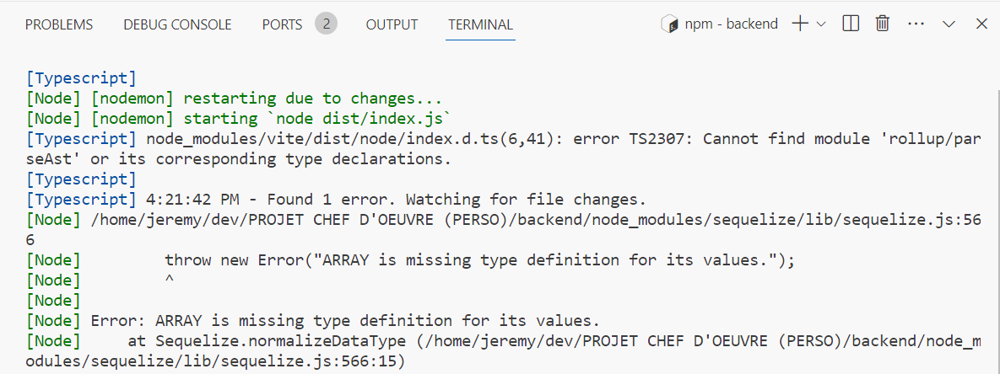
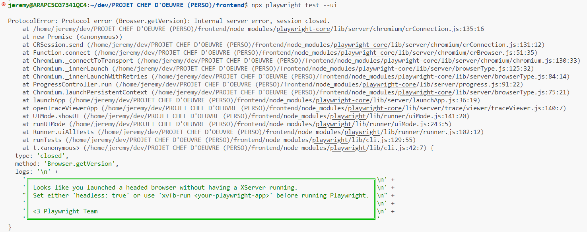
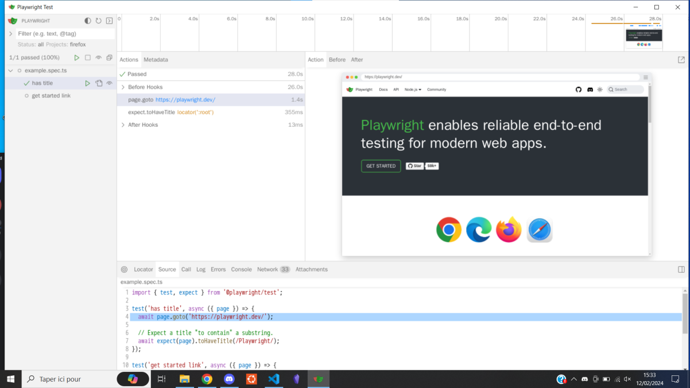

# JOURNAL DE BORD

**Ici, mettre tous la description des problèmes pertinents rencontrés et leur résolution avec des captures d'écran de code (en light mode)**

> S'EN SERVIR POUR ENRICHIR LE DOSSIER DE PROJET PERSONNEL

___
xx/xx/xxxx

## PROBLEME N°1 : "Erreur de compilation avec Typescript"

### Description du problème

Après avoir récupéré un template d'une API, et avoir lancé la commande "npm run dev", une erreur liée à Typecript est apparue :



Cela empechait l'execution du backend dans les navigateurs.

### Résolution du problème


J'ai supprimé le type "ARRAY" dans mes modèles de tables car il n'est pas reconnu (il a fallu que je crée de nouvelles tables "PAGE" et "SCENARIO" ainsi que des liaisons supplémentaires entre mes tables à la place de devoir gérer des tableaux)

___
18/01/2024

## PROBLEME N°2 : "Plantage de l'application sans raison apparente"

### Description du problème

L'application plante avec le message "nodemon" (...)

### Résolution du problème

J'ai redémarré le PC.


___
21/01/2024

## PROBLEME N°3 : "Mauvaise requête lors de l'ajout d'un utilisateur"

### Description du problème

Lors du lancement de la requête de création d'un utilisateur, le message d'erreur "Bad request" apparaissait.

### Résolution du problème

Première piste : Dans le User.create du fichier "userRouter" j'ai renseigné les noms des champs et leur valeurs respectives (et pas simplement leurs valeurs).

Deuxième piste : Dans le fichier "UserModel", j'ai changé le type du champs "phoneNumber" de "NUMBER" à "STRING" (car un numéro est peut-être trop grand pour être stocké comme étant un nombre) ; je peux désormais insérer des espacements et le +33 devant le numéro de téléphone.

___
12/02/2024

## PROBLEME N°4 : Erreur lors du lancement des tests en mode UI (dans le rapport DEVOPS)

### Description du problème

Je souhaitais pourvoir vérifier visuellement que les tests sur les éléments d'interface passaient correctement, c'est pourquoi (après avoir un suivi un TP en executant XLaunch et Node JS), j'ai lancé la commande pour lancer les tests en mode UI : ```npx playwright test --ui```. Après environ 2 minutes d'attente, voici le message d'erreur qui s'affiche :



### Résolution du problème

J'ai partagé mon répertoire gitHub à une collègue puis j'ai clonné le frontend de mon projet sur son PC (un autre Windows 10) puis, après avoir lancé XLaunch et taper les commandes suivantes :

```bash
npm install
npx playwright test --ui
```

Une interface "Playwright Test" s'est ouverte :



Il n'y a que 2 tests "has title" et "get started link" qui vérifient s'il y a un titre dans la page et s'il (...)


______________________________

PRISE DE NOTES NON RETENUE

___
19/01/2024

## PROBLEME :

### Description du problème

J'avais une table pour stocker les fiches mémos sur une BDD mais, suite à la remarque d'un de mes collègue, je me suis rendu compte qu'elle n'était pas nécessaire puisque ce sont des données en dure (qui ne sont pas censées changer) 

### Résolution du problème

J'ai supprimé la table MemoSheet du MCD, du modèle relationnel et de l'API. Et à la place, j'ai mis les infos de toutes les fiches mémos dans leur carrousel respectifs (en leur assignant un id) qui peuvent être soit visible, soit caché pour chaque utilisateur (gestion avec le local storage).


