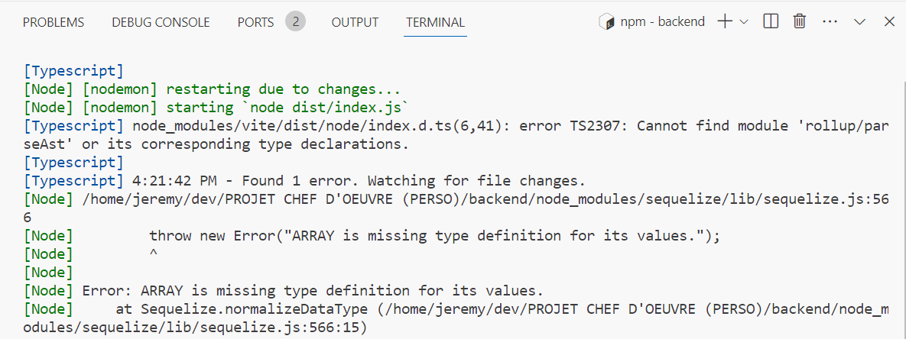

# JOURNAL DE BORD

**Ici, mettre tous la description des problèmes pertinents rencontrés et leur résolution avec des captures d'écran de code (en light mode)**

> S'EN SERVIR POUR ENRICHIR LE DOSSIER DE PROJET PERSONNEL

___
xx/xx/xxxx

## PROBLEME N°1 :

### Description du problème

Après avoir récupéré un template d'une API, et avoir lancé la commande "npm run dev", une erreur liée à Typecript est apparue :

Cela empechait l'execution du backend dans les navigateurs.

### Résolution du problème

J'ai supprimé le type "ARRAY" dans mes modèles de tables car il n'est pas reconnu (il a fallu que je crée de nouvelles tables "PAGE" et "SCENARIO" ainsi que des liaisons supplémentaires entre mes tables à la place de devoir gérer des tableaux)

___
18/01/2024

## PROBLEME N°2 :

### Description du problème

L'application plante avec le message "nodemon" (...)

### Résolution du problème

J'ai redémarré le PC.

______________________________

PRISE DE NOTES NON RETENUE

___
19/01/2024

## PROBLEME :

### Description du problème

J'avais une table pour stocker les fiches mémos sur une BDD mais, suite à la remarque d'un de mes collègue, je me suis rendu compte qu'elle n'était pas nécessaire puisque ce sont des données en dure (qui ne sont pas censées changer) 

### Résolution du problème

J'ai supprimé la table MemoSheet du MCD, du modèle relationnel et de l'API. Et à la place, j'ai mis les infos de toutes les fiches mémos dans leur carrousel respectifs (en leur assignant un id) qui peuvent être soit visible, soit caché pour chaque utilisateur (gestion avec le local storage).

