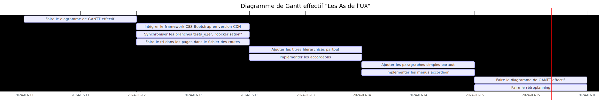

## RETROPLANNING POUR LE SPRINT DU 11/03/2024 AU 15/03/2024

## Compte rendu des problèmes réglés depuis le dernier sprint

- J'ai fait des commits beaucoup plus régulièrement, ce qui m'a permis de moins avoir à réfléchir pour leur nommage et aussi d'avoir un historique plus détaillé des différentes versions de mon projet
- J'ai pris l'habitude de créer une branche par ticket, ce qui m'a permis de me fixer des petits objectifs clairement identifiés
- Je me suis concentré sur la partie frontend de mon projet et cela m'a beaucoup plu car je pouvais vérifier visuelement le résultat dans le navigateur

## Compte rendu des problèmes rencontrés

- Mon diagramme de GANTT prévisionnel était trop ambitieux
- J'étais très fatigué le vendredi et j'avais donc du mal à me concentrer sur mon travail
- J'ai fait du CSS en même temps que l'implémentation des composants de Shadcn (même si j'avais prévu de le faire dans un second temps)
- J'ai eu du mal à prendre du recul sur mon travail lorsque je rencontrais une difficulté (et mon stress se faisait ressentir autour de moi)

## Déductions pour la suite du projet

- Programmer moins de choses pour ne pas être frustré
- Créer des tickets plus petits si besoin (pour avoir l'impression de progresser chaque jour)
- Essayer de se limiter aux tickets définis pour le sprint en cours (et de ne pas trop en rajouter en cours de route)
- Consacrer le vendredi après-midi à la rédaction du retroplanning et au diagramme de GANTT de la semaine suivante
