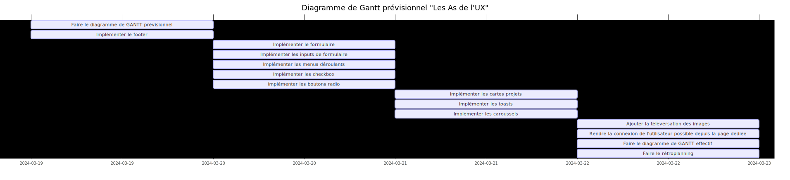
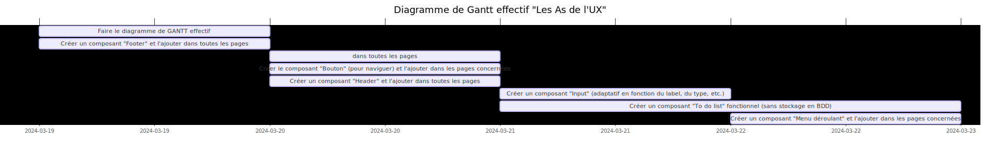

## RETROPLANNING POUR LE SPRINT DU 19/03/2024 AU 22/03/2024

## Compte rendu des problèmes réglés depuis le dernier sprint

- J'ai presque réussi à faire tout ce que j'avais indiqué dans mon diagramme de GANTT prévisionnel (planifié en début de sprint)
- J'ai bien avancé sur la partie frontend de mon application (fidèlement à mon prototype)
- J'ai fait des commits plus régulièrement (à chaque fois que je produis du code fonctionnel)

## Compte rendu des problèmes rencontrés
- J'étais absent le lundi 18/03/2024 (en raison notamment d'un entretien d'embauche le matin), ce qui m'a fait prendre du retard par rapport à l'avancement du projet
- Les tickets définis sur mon tableau KANBAN n'étaient pas assez précis
- J'ai trouvé que les composants générés par Shadcn étaient souvent compliqués à comprendre et donc à adapter (surtout pour changer leur style)
- J'ai passé beaucoup de temps à régler des problèmes de style

## Déductions pour la suite du projet

- Indiquer une condition d'arrêt précise pour chacun des tickets définis sur mon tableau KANBAN
- Faire des composants manuellement pour les éléments simples à concevoir et n'utiliser une bibliothèque React uniquement pour créer les composants plus complexes (menus déroulants, carrousels, etc.)
- Se concentrer davantage sur les scénarios utilisateurs essentiels au fonctionnement de l'application (réserver l'ajout du style et du vrai texte ultérieurement)
