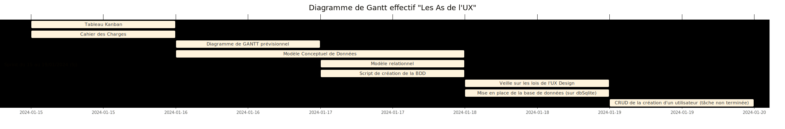

## RETROPLANNING POUR LE SPRINT DU 16/01/2024 AU 19/01/2024

## Compte rendu des problèmes rencontrés

- Mon diagramme de GANTT prévisionnel était trop ambitieux,

- J'ai perdu du temps à comprendre à quoi correspondait les différents schémas de conception de la base de données,

- J'avais du mal à prioriser les tickets dans le cadre du sprint,

- J'avais réussi à installer db SQLite sur le backend mais, en voulant mettre en place le base de données avec l'IasS Néon, un bug est survenu et j'ai eu beaucoup de mal à en déduire son origine,

- Lorsque je voulais faire le CRUD / l'authentification des utilisateurs, je me suis inspiré d'un précédent TP mais, en voulant copier-coller des trop gros bouts de code, j'ai mélangé de fonctionnalités non nécessaires pour la création d'un utilisateur.

- Comme j'avais de mal à comprendre un précédent TP sur le CRUD, j'avais du mal à prendre du recul et je me sentait de plus en plus agacé,

## Déductions pour la suite du projet

- Dans un contexte de travail en équipe, il faut que je veille à fixer des objectifs davantage réalistes (pour ne pas donner l'impression que je me suis vraiment engagé à réaliser tous mes tickets si je sais qu'il y a peu de probabilité que j'y parvienne),

- Rechercher ou demander des exemples visuels pour comprendre rapidement à quoi doit ressembler les shémas de conception (et aussi dans quel ordre les réaliser),

- Faire des commits plus fréquemment (à chaque ajout de bout de fonctionnalité qui fonctionne),

- Eviter de faire de gros copier-coller de code (pour en garder la maitrise et la bonne compréhension),

- Ne pas hésiter à demander de l'aide auprès du formateur ou d'un collègue car les solutions sont souvent plus faciles à trouver quand on exprime oralement les problèmes rencontrés.