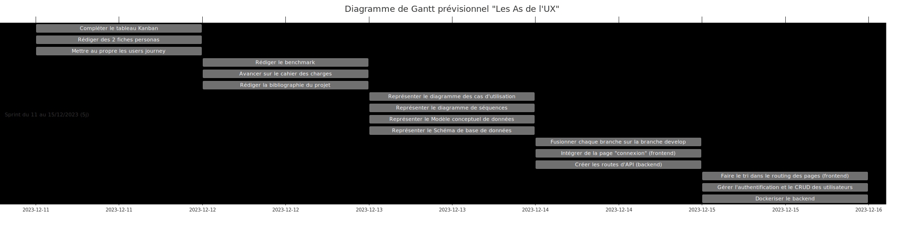
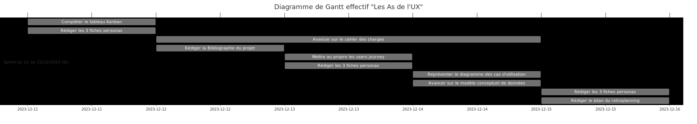

# RETROPLANNING POUR LE SPRINT DU 11/12/2023 AU 15/12/2023

## Compte rendu des problèmes rencontrés
- La charge de ce sprint a été sous-évaluée (la moitié des taches ont été entièrement terminées)
- Les taches en lien avec le developpement ont été planifiées en fin de semaine et n'ont donc pas pu être traitées en raison du retard accumulé (les taches en lien avec la gestion de projet ont pris toute la durée du sprint)
- Des taches non planifiées à l'avance ont été rajoutées au cours du sprint
- Plusieurs missions ont été décalées par rapport au jour de début de traitement planifié

## Déductions pour la suite du projet
- Etre plus raisonnable dans la charge de travail que chaque membre de l'équipe peut assumer
- Pour les missions auxquelles le membre n'est pas familiarisées,
il faut prendre plus de temps pour se documenter et analyser des exemples simples afin de ne pas fournir de détails inutiles
- Passer moins de temps à reformuler des phrases ou sur la disposition des élément mais se concentrer davantage sur le fond (la mise en forme peut être appliquée à la fin si le temps le permet)
- Ne pas modifier trop souvent les dates de début de mission pour respecter au maximum le diagramme de GANTT prévisionnel