## USER JOURNEY N°1 (avec Anthony YOUSSEF)

- **Création de compte :**
  - "Tout le monde n'a pas envie d'un avatar personnalisé, ni de répondre à la façon dont on a découvert l'application, ni de donner son numéro de téléphone (l'adresse mail est suffisante être contacté)."

- **Lexique :**
  - "Le filtre n'est pas nécessaire car il n'y aura probablement pas beaucoup de termes d'UX à parcourir et on peut simplement les ranger par ordre alphabétique sur une seule page."

- **Mes projets :**
  - "Il manque une bannière descriptive du projet (comme pour les briefs sur simplonline)."
  - "Il manque un bouton 'ajouter un projet' ou un bouton '+' (flottant en bas à droite) pour rediriger l'utilisateur sur une page dédiée afin de séparer le formulaire de nouveau projet avec les projets déjà référencés."

- **Formulaire de paiement :**
  - "Il manque une 3ème possibilité : on peut aussi payer par virement bancaire (où il faudra renseigner le RIB)."

- **Mon analyse UX :**
  - Il faut motiver l'utilisateur à partager leur analyse UX d'un projet en lui donnant des points immédiatement après l'envoi (et lui indiquer dès le début ce qu'il a à gagner en le faisant).

- **Tableau des gains :**
  - "Le mot "gain" fait trop penser au vocabulaire d'un casino."
  - "Supprimer la troisième colonne 'calcul en €' (pas besoin d'avoir le montant exact à remporter pour chaque place dans le classement ; le budget de l'analyse UX collective se suffit à lui-même)."
  - "Intégrer les informations de cette rubrique dans les CGU."

- **Paramètres :**
  - "Au lieu de rédiriger l'utilisateur sur une autre page à chaque fois qu'il clique sur un bouton, ce serait plus direct d'avoir un menu déroulant pour accéder aux détails de chaque paramètre."

## USER JOURNEY N°2 (avec Élodie BOTTON)

### REMARQUE DE L'INTERLOCUTEUR

- **Création de compte :**
  - "Il serait pertinent de demander la date de naissance des utilisateurs pour connaître les tranches d'âge majoritaires."

- **Grades :**
  - "Offrir quelques cartes d'UX en fonction du grade obtenu pour récompenser l’utilisateur de son investissement et lui donner envie de s'investir davantage (en publiant une analyse UX, en déposant un projet ou en faisant de la pub de bouche à oreille)."
  - "Conditionner la montée en grade par un nombre d'analyse UX ou de commentaires laissés (peut-être en vérifiant si ces derniers sont qualitatifs ou pas)."

- **Analyses UX :**
  - "Ajouter un bouton pour séparer les 2 actions possibles : “Rédiger une analyse UX” et “Voir l'analyse UX globale"."
  - "Il faut que l'utilisateur comprenne que rédiger des commentaires constructifs (sur des vrais projets de création ou de refontes de sites web) va le faire progresser en augmentant son esprit critique sur l’UX Design."

- **Analyse UX globale :**
  - "Rendre public le grade actuel de l’utilisateur dans les commentaires qu’il a laissés (afin que le client fasse plus attention aux utilisateurs de longue date de l'application lorsqu'il doit selectionner les 10 meilleures analyses UX)."